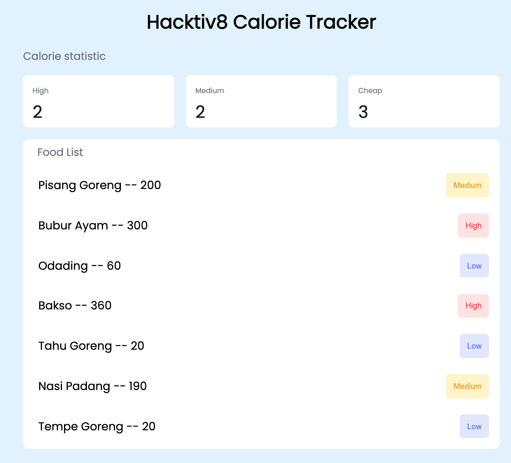

# Calorie Tracker

### NOTES

- Jalankan `npm install` terlebih dahulu
- Pada skeleton terdapat folder `__tests__`, folder ini beserta file-file di dalamnya tidak boleh diubah sama sekali.
- untuk menjalankan test untuk memastikan solusi kamu sudah benar, jalankan command `npm test`

### RESTRICTION

- Hanya boleh menggunakan built-in function untuk menambahkan atau mengurangi data dalam array, seperti .shift(), unShift(), push(), dan pop() dan built-in function untuk mengakses isi dalam object seperti for..in, for...of, Object.keys(), dll

### HINTS

- Nama function **tidak boleh diganti dengan nama function lainnya**. Untuk detail fungsi akan mengacu kepada [Directions](#directions) yang disebutkan di bawah

---

## Objectives

- Mampu mengakses array multidimensi atau array of objects
- Mampu membuat array of objects
- Mampu memberikan styling yang tepat untuk elemen html
- Mampu mengimplementasikan DOM
- Mampu Mengimplementasikan Modular Function

## Directions

Pada challenge kali ini, kalian diberikan sebuah file `index.html`, `index.js`, dan `style.css`, ketiga file ini bertujuan untuk menampilkan sebuah website sederhana, website ini menampilkan konten makanan dan jumlah kalori yang dikonsumsi oleh user yang tersedia pada file `index.js`, dan juga website ini menggunakan styling dari file `style.css` yang memiliki beberapa class yang dapat diterapkan pada element html.

### Release 1 - `convertFood`

Function ini akan menerima satu buah parameter berupa `array of string` dan akan dirubah menjadi `array multi dimensi`. Sebuah string dengan format `Pisang Goreng@200` akan dirubah menjadi sebuah array `['Pisang Goreng', '200']`. Terdapat juga sebuah string dengan format `Biskuit` yang akan dirubah menjadi sebuah array `['Biskuit']`.

```js
const foods = [
  'Pisang Goreng@200',
  'Biskuit',
  'Bubur Ayam@300',
  'Odading@60',
  'Bakso@360',
  'Tahu Goreng@20',
  'Nasi Padang@190',
  'Ayam Bakar',
  'Tempe Goreng@20',
  'Telur Rebus'
]

function convertFood(foods) {
  // code here
}

console.log(convertFood(foods))
/**
 * [
 *  ['Pisang Goreng', '200'],
 *  ['Biskuit'],
 *  ['Bubur Ayam', '300'],
 *  ['Odading', '60'],
 *  ['Bakso', '360'],
 *  ['Tahu Goreng', '20'],
 *  ['Nasi Padang', '190'],
 *  ['Ayam Bakar'],
 *  ['Tempe Goreng', '20'],
 *  ['Telur Rebus']
 * ]
 * /
```

### Release 2 - `filterFoods`

Function ini akan menerima sebuah `array 2 dimensi` dan akan melakukan penyaringan terhadap menu yang tidak memiliki `total kalori`. `total kalori` pada sebuah array `makanan` diwakilkan pada index pertama data tersebut.

**notes**

- Pada fungsi ini silahkan convert `total kalori` yang masih berupa `string` `'20'` menjadi sebuah `number` `20`

**Contoh**

```
['Pisang Goreng', '200'] => makanan ini memiliki total kalori '200'.

['Biskuit'], => makanan ini tidak memiliki total kalori dikarenakan hanya memiliki satu data didalamnya.
```

```js
const foods =  [
  ['Pisang Goreng', '200'],
  ['Biskuit'],
  ['Bubur Ayam', '300'],
  ['Odading', '60'],
  ['Bakso', '360'],
  ['Tahu Goreng', '20'],
  ['Nasi Padang', '190'],
  ['Ayam Bakar'],
  ['Tempe goreng', '20'],
  ['Telur Rebus']
 ]
function filterFoods(foods) {
  // your code here
}

console.log(filterFoods(foods))
/**
 * [
 *  ['Pisang Goreng', 200],
 *  ['Bubur Ayam', 300],
 *  ['Odading', 60],
 *  ['Bakso', 360],
 *  ['Tahu Goreng', 20],
 *  ['Nasi Padang', 190],
 *  ['Tempe goreng', 20]
 * ]
 * /

```

### Release 3 - `statusFood`

Function ini akan menerima satu buah parameter, parameter pertama `foods` merupakan `array multi dimensi` berisi kumpulan `makanan` yang dimakan,

Function ini akan memberikan kategori untuk setiap `foods` dengan aturan:

- Jika `total kalori` makanan melebihi `200` maka `food` tersebut memiliki status `high`.
- Jika `total kalori` makanan diantara `90` hingga `200` maka `food` tersebut memiliki status `medium`.
- Jika harga makanan dibawah `90` maka `food` tersebut memiliki status `low`.

```js
const foods = [
  ['Pisang Goreng', 200],
  ['Bubur Ayam', 300],
  ['Odading', 60],
  ['Bakso', 360],
  ['Tahu Goreng', 20],
  ['Nasi Padang', 190],
  ['Tempe goreng', 20]
]

function statusFood(foods) {
  // your code here
}

console.log(statusFood(foods))
/**
 * [
 *  ['Pisang Goreng', 200, 'medium'],
 *  ['Bubur Ayam', 300, 'high'],
 *  ['Odading', 60, 'low'],
 *  ['Bakso', 360, 'high'],
 *  ['Tahu Goreng', 20, 'low'],
 *  ['Nasi Padang', 190, 'medium'],
 *  ['Tempe goreng', 20, 'low']
 * ]
 */
```

### Release 4 - `statisticFood`

Function ini akan menerima satu parameter berupa `array 2 dimensi` kumpulan `foods`. Function ini akan mengembalikan sebuah `object` menandakan jumlah `food` yang memiliki status `high`, `medium` dan juga `low`.

```js
const foods =  [
  ['Pisang Goreng', 200, 'medium'],
  ['Bubur Ayam', 300, 'high'],
  ['Odading', 60, 'low'],
  ['Bakso', 360, 'high'],
  ['Tahu Goreng', 20, 'low'],
  ['Nasi Padang', 190, 'medium'],
  ['Tempe goreng', 20, 'low']
 ]

function statisticFood(foods) {
  // your code here
}

console.log(statisticFood(foods))
/**
 * {
 *   medium: 2,
 *   high: 2,
 *   low: 3
 * }
 *
```

### Release 5 - `generateFoodCalorie`

Function ini merupakan **main** function yang akan memanggil fungsi yang sudah dibuat sebelumnya. function ini akan menerima satu parameter berupa `array of string` yang akan mengembalikan sebuah `object` dengan dua `key`:

- `statistic` `key` ini akan berisi object jumlah `food` dengan status `high`, `medium` dan juga `low`.
- `foods` `key` ini akan berisi sebuah `array of object` kumpulan `food` yang ada. Format `object` pada `key` ini adalah:
  - `name` berisi nama dari `food`.
  - `price` berisi harga dari `food`.
  - `status` berisi status dari `food`.

```js
const foods = [
  'Pisang Goreng@200',
  'Biskuit',
  'Bubur Ayam@300',
  'Odading@60',
  'Bakso@360',
  'Tahu Goreng@20',
  'Nasi Padang@190',
  'Ayam Bakar',
  'Tempe Goreng@20',
  'Telur Rebus'
]


function generateFoodCalorie(foods) {}

console.log(generateFoodCalorie(foods))
/**
{
  statistic: { medium: 2, high: 2, low: 3 },
  foods: [
    { name: 'Pisang Goreng', totalCalorie: 200, status: 'medium' },
    { name: 'Bubur Ayam', totalCalorie: 300, status: 'high' },
    { name: 'Odading', totalCalorie: 60, status: 'low' },
    { name: 'Bakso', totalCalorie: 360, status: 'high' },
    { name: 'Tahu Goreng', totalCalorie: 20, status: 'low' },
    { name: 'Nasi Padang', totalCalorie: 190, status: 'medium' },
    { name: 'Tempe Goreng', totalCalorie: 20, status: 'low' }
  ]
}
```

### Release 6 - `DOM`

Setelah kamu berhasil menyelesaikan semua fungsi diatas, maka step selanjutnya adalah menampilkan data `statistic` dari `menu` yang kamu punya. Silahkan gunakan `DOM` untuk memasukkan data `statistic` dari javascript menuju `HTML`.

Tambahkan juga sebuah style CSS untuk memberikan warna background dan tulisan untuk ketiga button yang kita miliki. Warna yang digunakan bisa mengikuti table berikut ini:

| class        | Warna Background | Warna Text |
| ------------ | ---------------- | ---------- |
| `high-btn`   | #fee2e2          | #ef4444    |
| `medium-btn` | #fef3c7          | #f59e0b    |
| `low-btn`    | #e0e7ff          | #6366f1    |

Berikut adalah tampilan yang diharapkan untuk menyelesaikan release ini.


